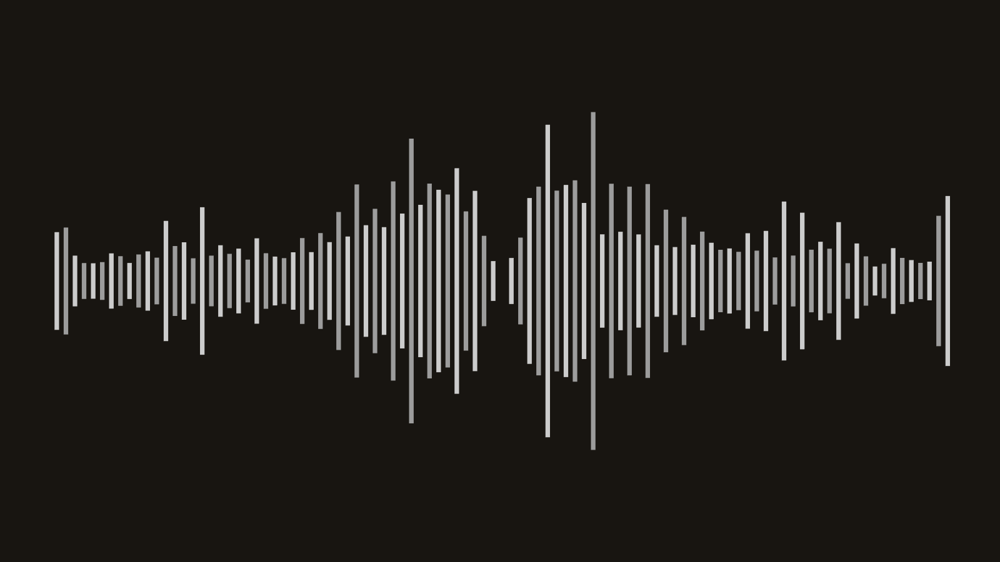
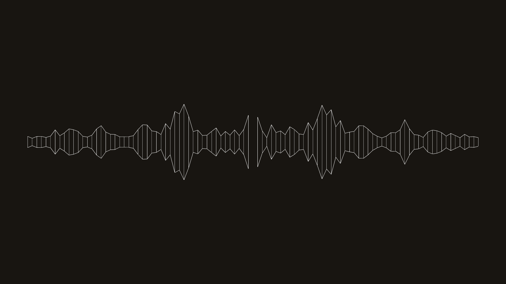
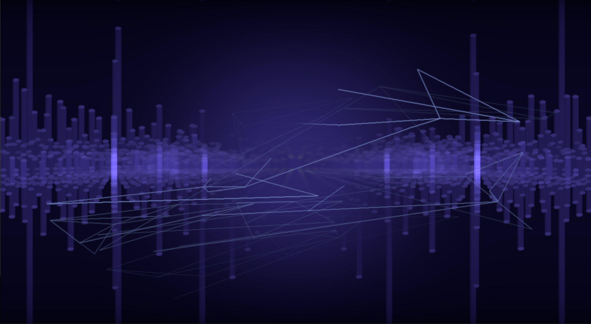
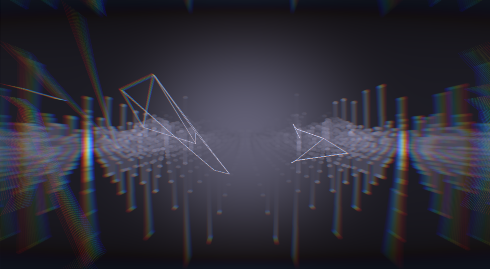

pa-visualizer
=============

A collection of pulseaudio visualizers

## Usage ##

### Live ###
Set (using `pavucontrol` or `pactl`) the default source to the monitor of
your speakers and start the visualizer with

```terminal
cargo run --release --bin pa-visualizer-<visualizer-name>
```

### Rendering ###
pa-visualizer also supports rendering a visualization. To do so, first convert your
audio file to a `.wav` (Format: 32 bit float, Samplerate: 8000). Then add the following
to the config of the visualizer you want to render:

```toml
RENDER_MODE = true
RENDER_FPS = 30.0
RENDER_SOUNDFILE = "name-of-your-file.wav"
RENDER_OUTPUT_DIRECTORY = "name-of-the-folder-to-put-the-frames-in"
```

Start the render by simply starting the visualizer:

```terminal
cargo run --release --bin pa-visualizer-<visualizer-name>
```

Finally, convert the images to a video, for example using the following `ffmpeg` command:

```terminal
ffmpeg -framerate 30 -i frames/%06d.png -i name-of-your-file.mp3 -c:v libx264 -preset slow -crf 22 -pix_fmt yuv420p -b:a 128k output.mp4
```


## Visualizers ##

### ascii ###
A simple debug visualizer, printing the left and right spectra to the terminal window

### python ###
A wrapper to write visualizers in python.

### sfml-simple ###

A basic visualizer made with sfml

### sfml-wireline ###

A visualizer made using sfml with a wireframe style

### sfml-wirecircle ###

Same as wireline, just "wrapping" it around a circle

### noambition ###

A 3d visualizer, written using glium based on the [Demo "No Ambition" by Quite & T-Rex](http://www.pouet.net/prod.php?which=69730)

### noambition2 ###

Taking the noambition visualizer to the next level ... Thanks to offdroid, for help with implementing this ...

## Shaders used ###
* [Gaussian Blur shader](https://www.shadertoy.com/view/XdfGDH) by mrhaircot
* [Bokeh disc shader](https://www.shadertoy.com/view/4d2Xzw) by David Hoskins
* [Chromatic Abberation shader](https://github.com/spite/Wagner/blob/master/fragment-shaders/chromatic-aberration-fs.glsl)
* [FXAA shader](https://github.com/mattdesl/glsl-fxaa)

## License ##
pa-visualizer licensed under either of

 * Apache License, Version 2.0 ([LICENSE-APACHE](LICENSE-APACHE) or http://www.apache.org/licenses/LICENSE-2.0)
 * MIT license ([LICENSE-MIT](LICENSE-MIT) or http://opensource.org/licenses/MIT)

at your option.
